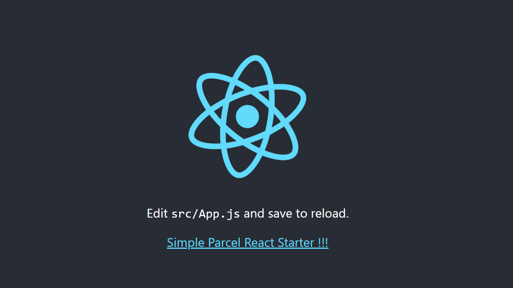

# Simple Parcel React Starter

A simplest React starter based on Parcel.


## Some VS Code Plugin

[Prettier - Code formatter](https://marketplace.visualstudio.com/items?itemName=esbenp.prettier-vscode)

[Eslint](https://marketplace.visualstudio.com/items?itemName=dbaeumer.vscode-eslint)

## Include

[React](https://reactjs.org) 16.8.1

[React-Dom](https://reactjs.org) 16.8.1

[Sass](https://sass-lang.com/install) 1.17.0

[Postcss-Modules](https://github.com/css-modules/postcss-modules) 1.4.1

[Autoprefixer](https://github.com/postcss/autoprefixer) 9.4.7

[Parcel](https://parceljs.org/) 1.11.0

### Babel 7.X and Plugins:

[@babel/preset-env](https://babeljs.io/docs/en/babel-preset-env)

[@babel/preset-react](https://babeljs.io/docs/en/babel-preset-react)

[@babel/plugin-proposal-class-properties](https://babeljs.io/docs/en/babel-plugin-proposal-class-properties)

[@babel/plugin-proposal-export-default-from](https://babeljs.io/docs/en/babel-plugin-proposal-export-default-from)

[BrowsersList](https://github.com/browserslist/browserslist)

## Need

Eslint Jest ...

## CSS Modules Config
Open `.postcssrc` file.

```json
{
  "modules": true,
  "plugins": {
    "autoprefixer": {
      "grid": true
    }
  }
}
```

`"modules": true`  -use camelCase classname in scss and js file.

`"modules": false` - use kebab-case classname as usual.

## Download

```
git clone https://github.com/daimalou/simple-parcel-react-starter
cd parcel-react-starter 
yarn or npm i
```

## Run

```
yarn dev && yarn build
npm run dev && npm run build
```

## ScreenShot


## Resource

[Parcel Documentation](https://parceljs.org/getting_started.html)

[eslint-config-react-app](https://www.npmjs.com/package/eslint-config-react-app)

[babel-preset-react-app](https://www.npmjs.com/package/babel-preset-react-app)

## License

MIT
